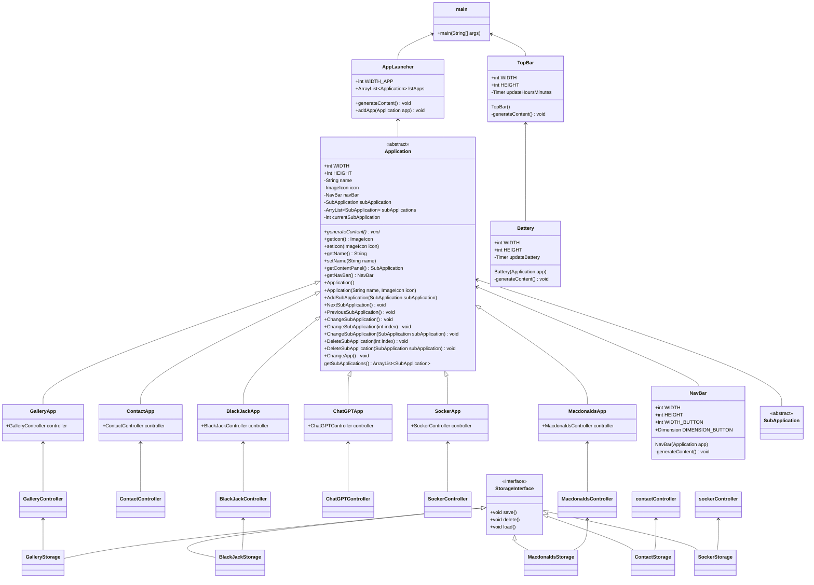
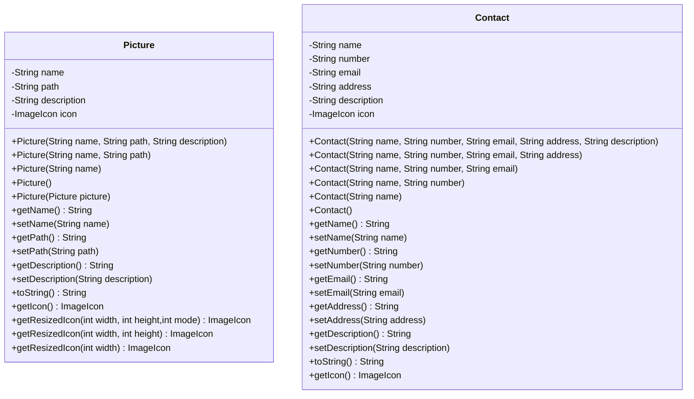

# Class diagramm schema

```mermaid
classDiagram
    Application <|-- GalleryApp
    Application <|-- ContactApp
    Application <|-- BlackJackApp
    Application <|-- ChatGPTApp
    Application <|-- SockerApp
    Application <|-- MacdonaldsApp
    Application <-- NavBar
    
    class Application{
        <<abstract>>
        +int WIDTH
        +int HEIGHT
        -String name
        -ImageIcon icon
        -NavBar navBar
        -SubApplication subApplication
        -ArryList~SubApplication~ subApplications
        -int currentSubApplication

        +generateContent()* void

        +getIcon() ImageIcon
        +setIcon(ImageIcon icon)
        +getName() String
        +setName(String name)
        +getContentPanel() SubApplication
        +getNavBar() NavBar

        +Application()
        +Application(String name, ImageIcon icon)
        +AddSubApplication(SubApplication subApplication)

        +NextSubApplication() void
        +PreviousSubApplication() void
        +ChangeSubApplication() void
        +ChangeSubApplication(int index) void
        +ChangeSubApplication(SubApplication subApplication) void

        +DeleteSubApplication(int index) void
        +DeleteSubApplication(SubApplication subApplication) void

        +ChangeApp() void

        getSubApplications() ArrayList~SubApplication~
    }

    Application <-- SubApplication
    class SubApplication{
        <<abstract>>
    }

    class main{
        +main(String[] args)
    }
    main <-- TopBar
    main <-- AppLauncher

    AppLauncher <-- Application

    class AppLauncher{
        +int WIDTH_APP
        +ArrayList~Application~ lstApps

        +generateContent() void
        +addApp(Application app) void
        
    }

    class NavBar{
        +int WIDTH
        +int HEIGHT
        +int WIDTH_BUTTON
        +Dimension DIMENSION_BUTTON

        NavBar(Application app)
        -generateContent() void

    }

    class Battery{
        +int WIDTH
        +int HEIGHT
        -Timer updateBattery

        Battery(Application app)
        -generateContent() void

    }

    TopBar <-- Battery
    class TopBar{
        +int WIDTH
        +int HEIGHT
        -Timer updateHoursMinutes

        TopBar()
        -generateContent() void
    }
    class GalleryApp{
        +GalleryController controller
    }
    class ContactApp{
        +ContactController controller
    }
    class BlackJackApp{
        +BlackJackController controller
    }
    class ChatGPTApp{
        +ChatGPTController controller
    }
    class SockerApp{
        +SockerController controller
    }
    class MacdonaldsApp{
        +MacdonaldsController controller
    }

    GalleryApp <-- GalleryController
    ContactApp <-- ContactController
    BlackJackApp <-- BlackJackController
    ChatGPTApp <-- ChatGPTController
    SockerApp <-- SockerController
    MacdonaldsApp <-- MacdonaldsController

    class GalleryController{
    }
    class ContactController{
    }
    class BlackJackController{
    }
    class ChatGPTController{
    }
    class SockerController{
    }
    class MacdonaldsController{
    }

    class StorageInterface{
        <<Interface>>
        +void save()
        +void delete()
        +void load()
    }

    StorageInterface <|-- GalleryStorage
    GalleryController <-- GalleryStorage
    class GalleryStorage {
    }
    contactController <-- ContactStorage
    StorageInterface <|-- ContactStorage
    class ContactStorage {
    }
    BlackJackController <-- BlackJackStorage
    StorageInterface <|-- BlackJackStorage
    class BlackJackStorage {
    }
    sockerController <-- SockerStorage
    StorageInterface <|-- SockerStorage
    class SockerStorage {
    }
    MacdonaldsController <-- MacdonaldsStorage
    StorageInterface <|-- MacdonaldsStorage
    class MacdonaldsStorage {
    }

    

```
# Entities

```mermaid
classDiagram
    class Picture{
        -String name
        -String path
        -String description
        -ImageIcon icon

        +Picture(String name, String path, String description)
        +Picture(String name, String path)
        +Picture(String name)
        +Picture()
        +Picture(Picture picture)

        +getName() String
        +setName(String name)
        +getPath() String
        +setPath(String path)
        +getDescription() String
        +setDescription(String description)

        +toString() String

        +getIcon() ImageIcon
        +getResizedIcon(int width, int height,int mode) ImageIcon
        +getResizedIcon(int width, int height) ImageIcon
        +getResizedIcon(int width) ImageIcon
     
    }

    class Contact{
        -String name
        -String number
        -String email
        -String address
        -String description
        -ImageIcon icon

        +Contact(String name, String number, String email, String address, String description)
        +Contact(String name, String number, String email, String address)
        +Contact(String name, String number, String email)
        +Contact(String name, String number)
        +Contact(String name)
        +Contact()

        +getName() String
        +setName(String name)
        +getNumber() String
        +setNumber(String number)
        +getEmail() String
        +setEmail(String email)
        +getAddress() String
        +setAddress(String address)
        +getDescription() String
        +setDescription(String description)

        +toString() String

        +getIcon() ImageIcon
    }

```